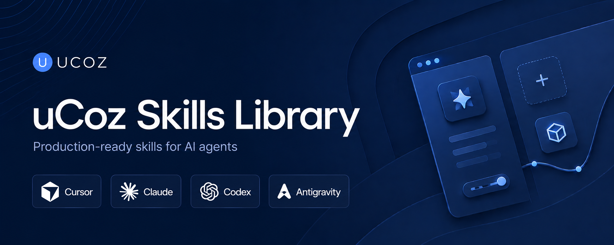

<p align="center">
  
</p>

# uCoz Agent Skills

Official [Agent Skills](https://agentskills.io) for AI agents working with uCoz: landing pages, site provisioning, ad campaigns.

Each skill ships with the [ucoz-mcp](https://www.npmjs.com/package/ucoz-mcp) server — install the plugin once and get both instructions and tools.

> **Security:** Credentials are used only with the official uCoz platform.
> See [SECURITY.md](SECURITY.md) for the full security policy.

Website catalog: [ucoz.com/ai/skills](https://www.ucoz.com/ai/skills)  
MCP documentation: [api.ucoz.net/mcp](https://api.ucoz.net/en/mcp.html)

## Available skills

| Skill | Description | Version |
|-------|-------------|---------|
| [ucoz-landing-skill](skills/ucoz-landing-skill/SKILL.md) | Generate and edit landing pages via MCP | 1.3 |
| [ucoz-provisioning-skill](skills/ucoz-provisioning-skill/SKILL.md) | Create or connect a uCoz site and configure MCP (uAPI, FTP, modules). Requires Playwright — see [browser-runner](skills/ucoz-provisioning-skill/browser-runner/) | 1.1 |
| [ucoz-ad-campaign-landing-skill](skills/ucoz-ad-campaign-landing-skill/SKILL.md) | Ad creative → segment landing pages, UTM, Yandex Direct / Google Ads push | 1.0 |
| [ucoz-shop-optimizer-skill](skills/ucoz-shop-optimizer-skill/SKILL.md) | Audit and improve uCoz Online Shop via MCP and uAPI | 0.6 |

## Installation

### Cursor (skills + MCP)

Install from GitHub — skills and MCP are configured together via [`.cursor-plugin/plugin.json`](.cursor-plugin/plugin.json):

**Settings → Rules → New Rule → Add from Github** → `https://github.com/ucoz-skills/agent-skills.git`

Or submit the repo at [cursor.directory/plugins/new](https://cursor.directory/plugins/new).

After install, open **Settings → Tools & MCP** and set environment variables for `ucoz-mcp` (see [MCP setup](#mcp-setup)).

### Codex (skills + MCP)

**Codex App** — install the uCoz plugin from the plugin catalog.

**Codex CLI** — run `/plugins`, select **uCoz**, and choose **Install Plugin**.

Skills load from `skills/`; MCP config is read from [`.mcp.json`](.mcp.json) via [`.codex-plugin/plugin.json`](.codex-plugin/plugin.json). Set uCoz environment variables in Codex MCP settings (see [MCP setup](#mcp-setup)).

### Antigravity (IDE + CLI)

[Google Antigravity](https://antigravity.google/docs/skills) discovers skills from `skills/` and supports bundled MCP via native plugins ([`plugin.json`](plugin.json) + [`mcp_config.json`](mcp_config.json)).

**Antigravity CLI — plugin install (recommended, skills + MCP):**

```bash
agy plugin install https://github.com/ucoz-skills/agent-skills.git
```

Installs globally under `~/.gemini/config/plugins/ucoz/`. Verify with `agy plugin list` and browse skills with `/skills` in the CLI.

**Antigravity IDE — Skills CLI:**

```bash
npx skills add ucoz-skills/agent-skills
```

Installs skill folders to `~/.agents/skills/` (discovered by Antigravity IDE). For skills shared across all Antigravity tools, copy them to `~/.gemini/skills/` instead — see [Antigravity skills docs](https://antigravity.google/docs/skills).

**Workspace-only install** — copy skill folders into `.agents/skills/` at your project root.

After install, set `UCOZ_*` environment variables for MCP (see [MCP setup](#mcp-setup)). When using the plugin path, MCP is bundled from [`mcp_config.json`](mcp_config.json); otherwise merge that file into `~/.gemini/config/mcp_config.json`.

Validate a local clone before installing:

```bash
agy plugin validate /path/to/agent-skills
```

### Hermes (Skills Hub)

[Hermes Agent](https://hermes-agent.nousresearch.com/docs/user-guide/features/skills) discovers skills from GitHub taps and the [skills.sh](https://skills.sh) index.

**Subscribe to the repo (custom tap):**

```bash
hermes skills tap add ucoz-skills/agent-skills
```

**Install skills:**

```bash
hermes skills install ucoz-skills/agent-skills/skills/ucoz-landing-skill
hermes skills install ucoz-skills/agent-skills/skills/ucoz-provisioning-skill
```

**Skills CLI** (also registers the repo with skills.sh telemetry for catalog indexing):

```bash
npx skills add ucoz-skills/agent-skills
```

After the first install, skills appear on [skills.sh/ucoz-skills/agent-skills](https://skills.sh/ucoz-skills/agent-skills) and in the Hermes Skills Hub index (refreshed periodically). Updates: push to GitHub; users run `hermes skills check` and `hermes skills update`.

> Hermes uses the GitHub API to browse taps. Set `GITHUB_TOKEN` in `~/.hermes/.env` (or run `gh auth login`) if you hit API rate limits.

### Claude Code (marketplace)

```bash
/plugin marketplace add ucoz-skills/agent-skills
/plugin install ucoz@ucoz-skills
```

Skills load from `skills/`; MCP config is read from [`.mcp.json`](.mcp.json) at the plugin root.

### Skills CLI (skills only)

```bash
npx skills add ucoz-skills/agent-skills
```

Install a single skill:

```bash
npx skills add ucoz-skills/agent-skills --skill ucoz-landing-skill
npx skills add ucoz-skills/agent-skills --skill ucoz-provisioning-skill
```

> Skills CLI installs instructions only. Add [`.mcp.json`](.mcp.json) to your project or IDE separately for MCP tools.

### Manual install

Copy a skill folder into your agent skills directory:

- `skills/ucoz-landing-skill`
- `skills/ucoz-provisioning-skill` (includes `browser-runner/` for Playwright provisioning)

| Tool | Skills path |
|------|-------------|
| Cursor | `.cursor/skills/` or `.agents/skills/` |
| Claude Code | `.claude/skills/` |
| Antigravity | `.agents/skills/` (workspace) or `~/.gemini/skills/` (global) |

## MCP setup

The repo includes [`.mcp.json`](.mcp.json) — bundled automatically when you install the **Cursor**, **Codex**, **Claude Code**, or **Antigravity** plugin.

MCP runs via stdio:

```bash
npx -y ucoz-mcp@latest
```

Set these environment variables in your IDE MCP settings:

| Variable | Description |
|----------|-------------|
| `UCOZ_API_TOKEN` | uAPI token from control panel |
| `UCOZ_SITE_URL` | Site URL, e.g. `https://example.ucoz.net/` |
| `UCOZ_FTP_HOST` | FTP host |
| `UCOZ_FTP_USER` | FTP username |
| `UCOZ_FTP_PASS` | FTP password |

Example MCP config (also in [`.mcp.json`](.mcp.json) and [`mcp_config.json`](mcp_config.json)):

```json
{
  "mcpServers": {
    "ucoz-mcp": {
      "command": "npx",
      "args": ["-y", "ucoz-mcp@latest"],
      "env": {
        "UCOZ_API_TOKEN": "your-token",
        "UCOZ_SITE_URL": "https://your-site.ucoz.net/",
        "UCOZ_FTP_HOST": "your-site.ucoz.net",
        "UCOZ_FTP_USER": "your-ftp-login",
        "UCOZ_FTP_PASS": "your-ftp-password"
      }
    }
  }
}
```

### MCP tools

| Tool | Purpose |
|------|---------|
| `templates_tool` | Page templates, menus, mail forms, backups |
| `ftp_tool` | Upload CSS/JS/images, manage site files |
| `modules_tool` | Install modules, quarantine/indexing |

## License

MIT — see [LICENSE](LICENSE).
